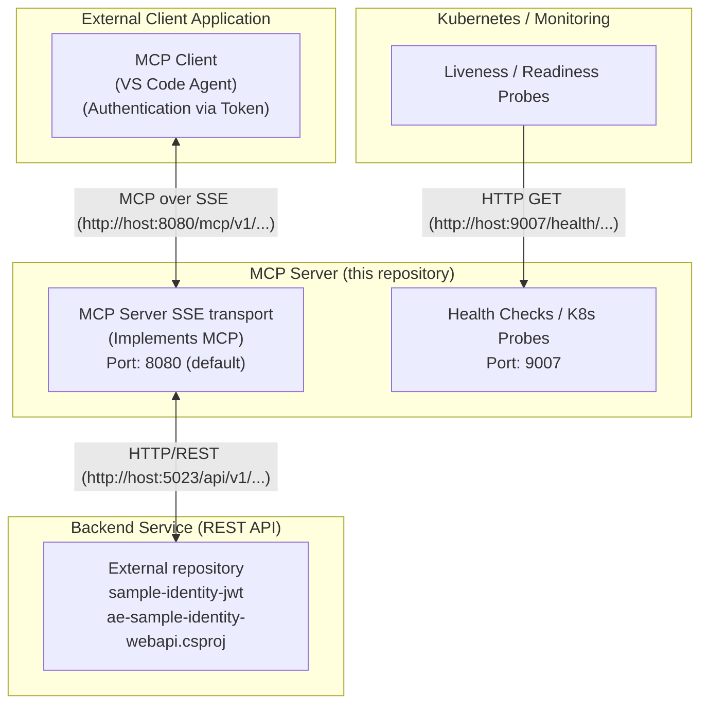

# ae-poc-identity-mcpsrv.sln
#	ae-poc-identity-mcp-srvsse.csproj
#	ae-poc-identity-mcp-lib.csproj
This repository contains projects (.net c#, https://github.com/modelcontextprotocol/csharp-sdk) with examples of Model Context Protocol (MCP) server with SSE transport for Identity Claims API
This application communicates with a backend REST Web API to function. 

## Architecture Overview

The solution consists of three main components:
1. **External Client Application**: Consumes the MCP server.
2. **MCP Server (this project)**: Acts as an intermediary, processing MCP requests over SSE and communicating with the backend API.
3. **Backend Service (REST API)**: Manages identity data.

Additionally, the MCP server exposes dedicated endpoints for Health Checks and Kubernetes Probes on a separate port.



## Communicating with the Backend REST API
Before running the application, you need to ensure the required API service is running. Please start the `ae-sample-identity-webapi` service from the `sample-identity-jwt` repository. Refer to the instructions within the `sample-identity-jwt` repository to build and run the service.


## Testing the MCP Server
You can use the provided `ae-poc-identity-mcp-srvsse/mcp-listen.http`, `ae-poc-identity-mcp-srvsse/mcp-requests.http` files to test the MCP server.

## Health Checks
You can manually check the health of the service using the provided `health.http` file.

1. Open `ae-poc-identity-mcp-srvsse/health.http`.
2. Ensure the application is running.
3. Click "Send Request" above the `GET` request to verify the service status.

### Kubernetes Configuration
Configure your Liveness and Readiness probes as follows:

```yaml
livenessProbe:
  httpGet:
    path: /health/live
    port: 9007
  initialDelaySeconds: 5
  periodSeconds: 10

readinessProbe:
  httpGet:
    path: /health/ready
    port: 9007
  initialDelaySeconds: 5
  periodSeconds: 10
```

## Running with .NET

You can also run the MCP server using the .NET CLI

1. Ensure the backend service is running (or accessible).
2. Run:
```bash
dotnet run --project ae-poc-identity-mcp-srvsse/ae-poc-identity-mcp-srvsse.csproj --configpath=./ae-poc-identity-mcp-srvsse
```

## Running with Docker Compose
The easiest way to run the application locally is using Docker Compose.

1. Ensure the backend service is running (or accessible).
2. Run:
```bash
docker-compose up --build
```
This will start the service on port `3001` (mapped to internal `8080`) and health checks on `9007`.

## Running with Docker

You can also run the MCP server using Docker.

### Prerequisites
- Docker installed and running.

### Build the Image
Navigate to the solution root directory and run:
```bash
docker build -t ae-poc-identity-mcp-srvsse -f ae-poc-identity-mcp-srvsse/Dockerfile .
```

### Run the Container
Run the container, mapping port 8080 to a host port (e.g., 3001). You can override configuration settings using environment variables.

```bash
docker run --rm -p 3001:8080 -p 9007:9007 \
  -e Authentication__ExpectedToken="YOUR_SECURE_TOKEN" \
  -e IdentityStorageApi__ApiUrl="http://host.docker.internal:5023" \
  ae-poc-identity-mcp-srvsse
```

> [!NOTE]
> `host.docker.internal` is used to access services running on the host machine from within the container. Adjust the `IdentityStorageApi__ApiUrl` if your backend service is running elsewhere.

### Configuration via Environment Variables
You can override any setting in `mcpsrvidentitysettings.json` using environment variables with the double underscore `__` separator.
- `Authentication__ExpectedToken`: The token required by the MCP client.
- `IdentityStorageApi__ApiUrl`: The URL of the backend identity service (e.g. `http://0.0.0.0:5023`).
- `App__Name`: The name of the MCP server application.
- `App__Version`: The version of the MCP server application.
- `App__Url`: The URL to bind the application to (e.g. `http://0.0.0.0:8080`).

### Configuration Path
The application loads configuration (`mcpsrvidentitysettings.json`) from the current working directory by default. You can override this location using:
1.  **Command Line Argument**: `--configpath=/path/to/config`
2.  **Environment Variable**: `CONFIG_PATH=/path/to/config`

The application supports relative paths (e.g., `--configpath=.` or `--configpath=../config`). It resolves them relative to the current working directory first, and then falls back to the executable's directory if the path is not found.

## VS Code Agent Setup

This repository includes a template configuration file to help you connect the VS Code Agent to this MCP server.

### Configuration (`.vscode/mcp.json`)

The configuration should be placed in `.vscode/mcp.json`. This file is **git-ignored** to prevent leaking secrets.

**Steps to configure:**

1.  Copy `.vscode/mcp.template.json` to `.vscode/mcp.json` if it does not exist.
2.  Open `.vscode/mcp.json` and replace the placeholder token with your actual secret (matching `Authentication:ExpectedToken` in your app settings):

```json
{
    "servers": {
        "ae-identity-claims": {
            "url": "http://localhost:8080/mcp/v1/claims/sse",
            "type": "sse",
            "headers": {
                "Authorization": "Bearer my-secret-token"
            }
        }
    },
    "inputs": []
}
```

3.  Restart the VS Code Agent or reload the window to apply the changes.
