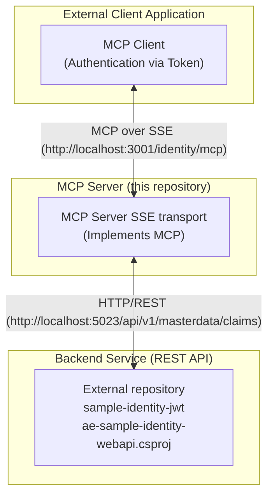

# ae-poc-identity-mcpsrv.sln
#	ae-poc-identity-mcp-srvsse.csproj
#	ae-poc-identity-mcp-lib.csproj
This repository contains projects (.net c#, https://github.com/modelcontextprotocol/csharp-sdk) with examples of Model Context Protocol(MCP) server with SSE transport for Identity Claims API
This application communicates with a backend REST Web API to function. 

## Architecture Overview

The solution consists of three main components: the external client application (implemented MCP client), the MCP server (this project), and a backend service (REST API) for identity management. The MCP server acts as an intermediary layer, processing client requests and communicating with the backend API for tasks such as authentication.



## Communicating with the backend REST API
Before running the application, you need to ensure the required API service is running. Please start the `ae-sample-identity-webapi` service from the `sample-identity-jwt` repository. Refer to the instructions within the `sample-identity-jwt` repository to build and run the service.


## Testing the MCP Server
You can use the provided `ae-poc-identity-mcp-srvsse/mcp-listen.http`, `ae-poc-identity-mcp-srvsse/requests.http` files to test the MCP server.

## Health Checks
You can manually check the health of the service using the provided `health.http` file.

1. Open `ae-poc-identity-mcp-srvsse/health.http`.
2. Ensure the application is running.
3. Click "Send Request" above the `GET` request to verify the service status.

### Kubernetes Configuration
Configure your Liveness and Readiness probes as follows:

```yaml
livenessProbe:
  httpGet:
    path: /health/live
    port: 8080
  initialDelaySeconds: 5
  periodSeconds: 10

readinessProbe:
  httpGet:
    path: /health/ready
    port: 8080
  initialDelaySeconds: 5
  periodSeconds: 10
```

## Running with Docker

You can also run the MCP server using Docker.

### Prerequisites
- Docker installed and running.

### Build the Image
Navigate to the solution root directory and run:
```bash
docker build -t ae-poc-identity-mcp-srvsse -f ae-poc-identity-mcp-srvsse/Dockerfile .
```

### Run the Container
Run the container, mapping port 8080 to a host port (e.g., 3001). You can override configuration settings using environment variables.

```bash
docker run --rm -p 3001:8080 \
  -e Authentication__ExpectedToken="YOUR_SECURE_TOKEN" \
  -e IdentityStorageApi__ApiUrl="http://host.docker.internal:5023" \
  ae-poc-identity-mcp-srvsse
```

> [!NOTE]
> `host.docker.internal` is used to access services running on the host machine from within the container. Adjust the `IdentityStorageApi__ApiUrl` if your backend service is running elsewhere.

### Configuration via Environment Variables
You can override any setting in `appsettings.json` using environment variables with the double underscore `__` separator.
- `Authentication__ExpectedToken`: The token required by the MCP client.
- `IdentityStorageApi__ApiUrl`: The URL of the backend identity service.
