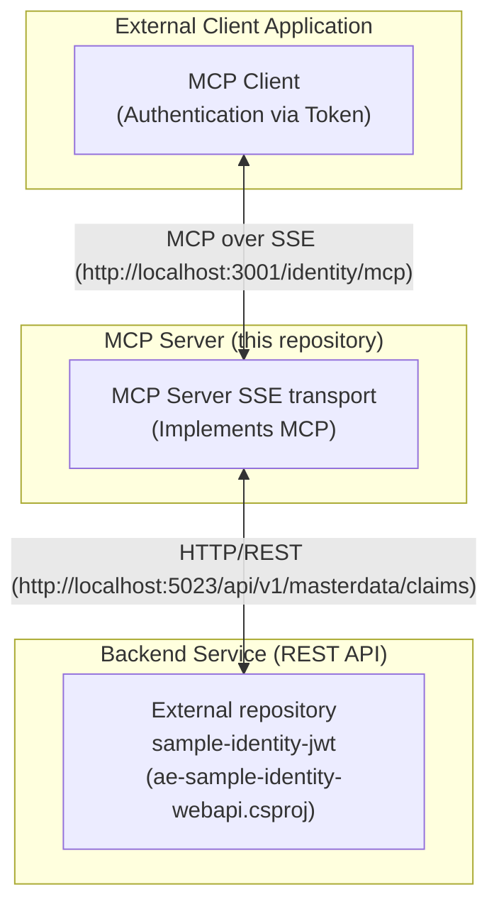

# ae-poc-identity-mcpsrv.sln
#	ae-poc-identity-mcp-srvsse.csproj
#	ae-poc-identity-mcp-lib.csproj
This repository contains projects (.net c#, https://github.com/modelcontextprotocol/csharp-sdk) with examples of Model Context Protocol(MCP) server with SSE transport for Identity Claims API
This application communicates with a backend REST Web API to function. 

## Architecture Overview

The solution consists of three main components: the external client application (implemented MCP client), the MCP server (this project), and a backend service (REST API) for identity management. The MCP server acts as an intermediary layer, processing client requests and communicating with the backend API for tasks such as authentication.

## Communicating with the backend REST API
Before running the application, you need to ensure the required API service is running. Please start the `ae-sample-identity-webapi` service from the `sample-identity-jwt` repository. Refer to the instructions within the `sample-identity-jwt` repository to build and run the service.

