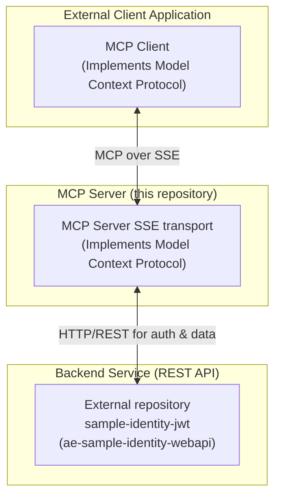

# ae-poc-identity-mcpsrv.sln
#	ae-poc-identity-mcp-srvsse.csproj
#	ae-poc-identity-mcp-lib.csproj
This repository contains projects (.net c#, https://github.com/modelcontextprotocol/csharp-sdk) with examples of SSE MCP server for Identity Claims API
This application communicates with a backend REST Web API to function. 

## Architecture Overview

The solution consists of three main components: the MCP client, the MCP Server (this project), and a backend REST API for identity management. The MCP Server acts as a middle layer, handling requests from the client and communicating with the backend API for tasks like authentication.

## Communicating with the backend REST API
Before running the application, you need to ensure the required API service is running. Please start the `ae-sample-identity-webapi` service from the `sample-identity-jwt` repository. Refer to the instructions within the `sample-identity-jwt` repository to build and run the service.

